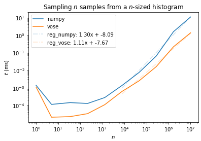
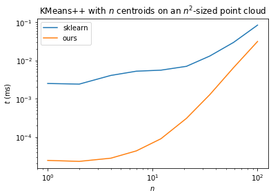

# Efficient clustering 

This package implements usual algorithms for clustering, with a bias towards optimal transport estimation. They're written in C++, with `Eigen`, and wrapped in Python with `PyBind`. Useful things you can find here are:
* Clustering:
    * KMeans++ algorithm
    * A Vose Alias sampler for efficient sampling of discrete distributions.
    * AFKMC^2 algorithm, which uses the aforementioned sampler. The resulting algorithm has the right complexity! 
* Regularized transport:
    * Sinkhorn algorithm
    * Greenhorn algorithm, with an emphasis on stable computation: in particular, I avoid using the renormalization of P at each step, which is a `O(n^2)` operation.

## Install

You need the two following librairies in your include path: 
* [Eigen](http://eigen.tuxfamily.org/index.php?title=Main_Page)
* [Pybind](https://pybind11.readthedocs.io/en/latest/)

Those are header only librairies. You only need to download them and include them in your C++ include path. E.g, extract them in `/usr/local/include` and add in your `.bashrc`:
```bash
# Show eigen library
export CPLUS_INCLUDE_PATH="$CPLUS_INCLUDE_PATH:/usr/local/include/eigen3"

# Show PyBind library
export CPLUS_INCLUDE_PATH="$CPLUS_INCLUDE_PATH:/usr/local/include/pybind11/include"
```
Otherwise, you can simply include the directories directly in the `CMakeLists.txt` file.

I guess a more standard way is to include the librairies directly in the repo, as I did with Google Test. In the Todos. 

Then, simply do `pip install .`, after having moved to the appropriate environment if you use `conda` or `pyenv`. 

## Speed comparison

For the Vose Alias sampling: 



For the KMeans++ implementation:


## Disclaimers

This was my first experience with C++, CMake, Pybind, Eigen, and testing. Obviously, there are likely horrible things lying here and there; if you find mistakes, please consider making a PR! 

Otherwise, this was mainly to get me acquainted with the previously mentioned tools. This has not the vocation for being push on pip. 

## TODO

### Install

For now, I set the CMake build type manually in `pybind.cpp`: `set(CMAKE_BUILD_TYPE Release)`. This can cause problem when building with CMake (make sure CMake is called with the same flag as the one in `pybind.cpp`!). I did this to ensure the `setup.py` file uses the `Release` configuration. There must certainly be a way to avoid that. 

### AFKMC^2 

* Add the possibility to pass an array of random numbers: this is the bottleneck in term of speed. 

### Clustering

* Add tests for the clustering algorithms. 

### Khorn

* Add the storage order as a template parameter, to allow for matrices stored in column-major. 

### Python interface

* Make a better python interface in the Python package. 

### Builds

Clean once and for all the external librairies. For now, they are installed locally and added to the C++ include path. Fix:
* GoogleTest: make it download in CMake
* Eigen, Pybind: put them in the `lib`. 

## References 

* [`k-means++`: The Advantages of Careful Seeding](http://ilpubs.stanford.edu:8090/778/1/2006-13.pdf)
* [Fast and Provably Good Seedings for k-Means](https://papers.nips.cc/paper/6478-fast-and-provably-good-seedings-for-k-means)
* [On the Alias Method for Generating Random Variables from a Discrete Distribution](https://www.tandfonline.com/doi/abs/10.1080/00031305.1979.10482697)
* [On the Efficiency of the Sinkhorn and Greenkhorn Algorithms and Their Acceleration for Optimal Transport](https://arxiv.org/abs/1906.01437)
* [Near-linear time approximation algorithms for optimal transport via Sinkhorn iteration](https://arxiv.org/abs/1705.09634)